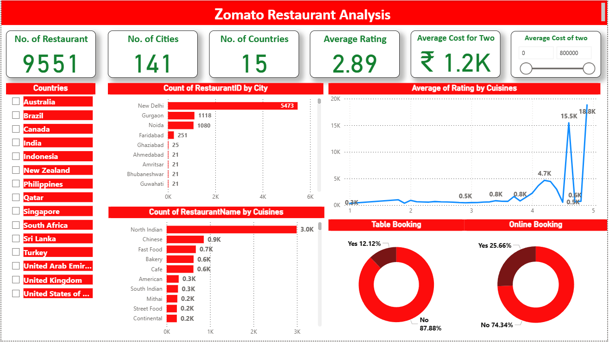

# 🍽️ Zomato Data Analysis (Power BI Dashboard)

This project focuses on **Zomato data analysis** using **Power BI** to explore restaurant trends across countries, cities, cuisines, and customer preferences.  
It provides visual insights and answers to key business questions based on restaurant listings, ratings, and cost data.

---

## 📊 Dashboard Overview

  

---

## 📁 Files in This Repository

| File | Description |
|------|--------------|
| `zomatoanalysis.pbix` | Power BI dashboard file containing all visuals and reports. |
| `zomato_data.xlsx` | Excel dataset used for analysis. |

---

## 🧠 Key Business Questions Solved

1. **Which country has the most restaurants listed?**  
2. **Which cities stand out with the highest number of restaurants?**  
3. **Which cuisine is the most popular based on the count of restaurants?**  
4. **How does the average rating vary by cuisine?**  
5. **Table Booking & Online Delivery adoption:**  
   - How many restaurants offer table booking vs. online delivery?  
6. **Cost vs. Rating Analysis:**  
   - Is there any correlation between the *cost for two* and *average rating*?  
   - Does higher cost correlate with higher or lower ratings?

---

## 📈 Insights

- Countries like **India** and **USA** dominate with the largest number of restaurants listed.  
- **Popular cuisines** such as North Indian, Chinese, and Fast Food appear across most major cities.  
- A positive correlation is observed between **average rating** and **affordability** in certain cities.  
- Adoption of **online delivery** and **table booking** varies significantly by city and cuisine type.  

---

## 🛠️ Tools & Technologies

- **Power BI** – for dashboard creation and visual analytics  
- **Microsoft Excel** – for data preprocessing and cleaning  
- **Zomato Dataset** – source of restaurant data  

---

## 🚀 How to Use

1. Download both files (`zomatoanalysis.pbix` and `zomato_data.xlsx`).  
2. Open the `.pbix` file in **Power BI Desktop**.  
3. If prompted, update the dataset source path to your local system.  
4. Explore the interactive visualizations and insights.

---

## 📚 Future Improvements

- Integrate live data from Zomato API.  
- Add sentiment analysis on restaurant reviews.  
- Include geographical heatmaps for country-level comparison.  

---

## 👨‍💻 Author

**Aayush Dhote**  
Power BI | Data Analysis | Visualization Enthusiast  

If you like this project, ⭐️ the repository!

---
